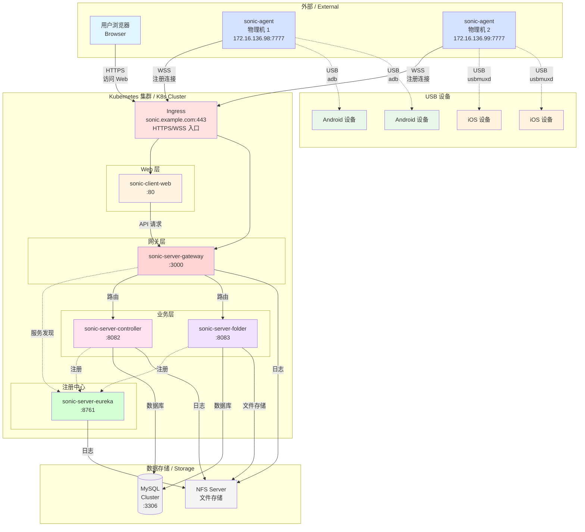

# Sonic Cloud Platform - Kubernetes All-in-One Deployment
# Sonic 云真机平台 - Kubernetes 一体化部署

## 📋 概述 / Overview

本配置提供了 Sonic 云真机平台在 Kubernetes 环境下的完整部署方案，采用微服务架构，包含服务注册中心、API 网关、核心控制器、文件服务和 Web 前端。

This configuration provides a complete deployment solution for Sonic Cloud Platform in Kubernetes environment, using microservice architecture including service registry, API gateway, core controller, file service, and web frontend.

## 🏗️ 架构说明 / Architecture



### 通信协议 / Communication

|通信方向|协议|端口|说明|
|-|-|-|-|
|浏览器 → Ingress | HTTPS/WSS | 443 | 用户访问 |
|Agent → Ingress | WSS | 443 | Agent 连接 |
|Ingress → Gateway | WS/HTTP | 3000 | 内部通信 |
|Gateway → Controller | WS/HTTP | 8082 | 内部通信 |
|Gateway → Folder | HTTP | 8083 | 内部通信 |
|Controller → MySQL | MySQL | 3306 | 数据库 |
|Agent → 设备 | USB | - | 本地 USB |


## 📦 部署前准备 / Prerequisites

### 必需组件 / Required

- ✅ Kubernetes 集群 (v1.20+)
- ✅ kubectl 命令行工具
- ✅ MySQL 数据库 (5.7+ / 8.0+)
- ✅ NFS 存储服务器（用于日志和文件存储）
- ✅ Ingress Controller (nginx-ingress 推荐)

### 可选组件 / Optional

- ⚠️ LDAP/AD 服务器（如果启用 LDAP 认证）
- ⚠️ TLS 证书（HTTPS 访问）

### 准备 MySQL 数据库 / Prepare MySQL Database
```sql
-- 创建数据库 / CREATE DATABASE
CREATE DATABASE IF NOT EXISTS sonic 
    CHARACTER SET utf8mb4 
    COLLATE utf8mb4_unicode_ci;

-- 创建用户 / CREATE USER
CREATE USER IF NOT EXISTS 'sonic_client'@'%' IDENTIFIED BY 'your-password';

-- 授权 / GRANT PRIVILEGES
GRANT ALL PRIVILEGES ON sonic.* TO 'sonic_client'@'%';
FLUSH PRIVILEGES;
```

### 准备 NFS 目录 / Prepare NFS Directories
```shell
# 在 NFS 服务器上创建目录
sudo mkdir -p /autoops/data/sonic/{keepFiles,imageFiles,recordFiles,packageFiles}
sudo mkdir -p /autoops/log/sonic

# 设置权限
sudo chown -R nobody:nogroup /autoops/data/sonic
sudo chown -R nobody:nogroup /autoops/log/sonic
sudo chmod -R 777 /autoops/data/sonic
sudo chmod -R 777 /autoops/log/sonic

# 配置 NFS 导出
sudo nano /etc/exports

# 添加：
/autoops/data/sonic *(rw,sync,no_subtree_check,no_root_squash)
/autoops/log/sonic *(rw,sync,no_subtree_check,no_root_squash)

# 重新加载
sudo exportfs -ra
```

## ⚙️ 配置说明 / Configuration
必须修改的配置项 / Required Configuration
在部署前，编辑 sonic-all-in-one.yaml 中的 ConfigMap，修改以下配置：

### 基础配置 / Basic Settings
```yaml
  # 服务器访问地址（Ingress 域名）
  server_host: sonic.example.com        # ← 改成你的域名

  # 密钥（用于 JWT Token 加密）
  secret_key: xxxxx                     # ← 改成随机字符串（32位）
  
  # 管理员账号
  permission_super_admin: sonic         # ← 改成你的管理员用户名

```
### MySQL 配置 / MySQL Settings
```yaml
  mysql_host: mysql-cluster-01.example.com  # ← 你的 MySQL 地址
  mysql_port: "3306"
  mysql_database: sonic
  mysql_username: sonic_client          # ← 你的数据库用户名
  mysql_password: xxxxx                 # ← 你的数据库密码
```

### NFS 配置 / NFS Settings
```yaml
# 在各 Deployment 的 volumes 部分
volumes:
  - name: sonic-log-store
    nfs:
      path: /autoops/log/sonic
      server: nfs-cluster-01.example.com  # ← 你的 NFS 服务器地址
```

### Agent 配置 / Agent Settings

#### config/application-sonic-agent.yml

```yaml
sonic:
  agent:
    # Replace with
    ws-scheme: wss
    # Replace with ipv4 of the agent machine | 替换为部署Agent机器的ipv4
    host: sonic-agent1.example.com
    # Replace with the port of the agent service, which can be changed by yourself | 替换为Agent服务的端口，可以自行更改
    port: 7777
    #
    service-port: 443
    # Replace with the key of agent generated by the new front-end | 替换为前端新增Agent生成的key
    key: c513a736-9eff-452e-8820-e6353e51f1bf
  server:
    #
    scheme: https
    # Change to SONIC_SERVER_HOST of server | 改成server的SONIC_SERVER_HOST
    host: sonic.example.com
    # Change to SONIC_SERVER_PORT of server | 改成server的SONIC_SERVER_PORT
    port: 443

# The following will be migrated to the server configuration in the future | 以下未来会迁移到server配置
modules:
  ios:
    # Replace with the bundleId of wda. If there is no. xcrunner suffix, it will be automatically completed. | 替换为wda的bundleId，如果没有.xctrunner后缀会自动补全
    wda-bundle-id: com.sonic.WebDriverAgentRunner
    # (mac only) Replace with the xcode project path of wda. | 替换为wda的xcode project目录
    wda-xcode-project-path: WebdriverAgent/WebDriverAgent.xcodeproj
```

#### /etc/systemd/system/sonic-agent.service
```ini
[Unit]
Description=Sonic Agent Service
After=network-online.target
Wants=network-online.target

[Service]
Type=simple

# Use root (USB permission reuqired)
User=root
Group=root
WorkingDirectory=/opt/sonic-agent
ExecStart=/usr/bin/java -Dfile.encoding=utf-8 -Xms512m -Xmx1024m -jar sonic-agent-linux-x86_64.jar

Restart=on-failure
RestartSec=10
StartLimitInterval=300
StartLimitBurst=5

LimitNOFILE=65536

TimeoutStartSec=90

[Install]
WantedBy=multi-user.target
```

## 可选配置 / Optional Configuration
### LDAP 配置 / LDAP Settings
```yaml
  # 启用 LDAP 认证
  sonic_ldap_enable: "true"             # ← 改为 true 启用
  
  # LDAP 服务器
  spring_ldap_url: ldap://172.16.0.1    #:3268
  spring_ldap_base: DC=example,DC=com
  spring_ldap_username: auth_ldap@example.com
  spring_ldap_password: xxxxx
  
  # LDAP 用户搜索
  sonic_ldap_user_base_dn: ""           # 留空从 base 搜索
  sonic_ldap_object_class: user         # AD 用 user，OpenLDAP 用 person
  sonic_ldap_user_id: sAMAccountName    # AD 用户 ID 属性
```

### 功能开关 / Feature Flags
```yaml
  register_enable: "true"          # 是否允许用户注册
  normal_user_enable: "true"       # 是否启用普通用户
  permission_enable: "true"        # 是否启用权限系统
```